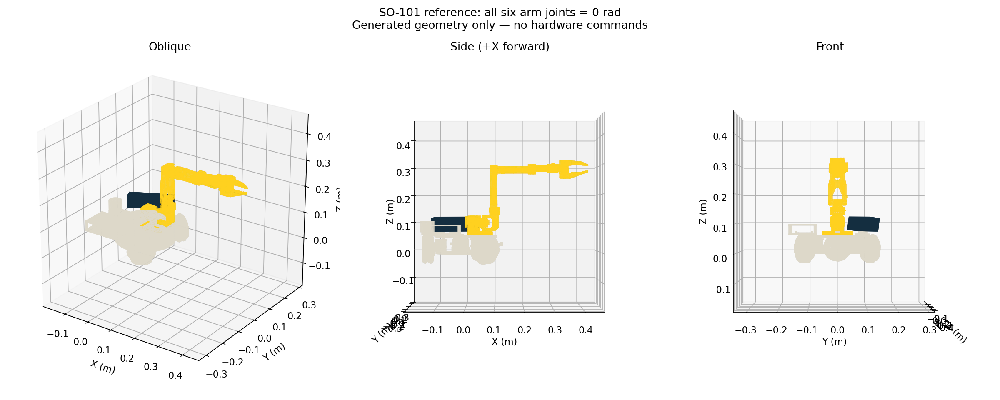

# LeKiwi robot description

`lekiwi_cad.urdf` and `meshes/` are generated by `scripts/vendor-lekiwi-model.py`
from the complete Xacro in [`robotmindio/LeKiwi`](https://github.com/robotmindio/LeKiwi),
at the revision recorded automatically in [model-source.json](model-source.json).
The physical model uses the
pinned official SO-101 follower geometry, inertias, axes, and travel ranges
while retaining the nine stable LeRobot joint names. The wrist-flex visual is
the validated native CadQuery part 8, exported in the official mesh frame.

The ROS copy makes three intentional, documented adaptations: drive-wheel
joints are fixed because the hardware publishes no wheel encoders; the six
arm joints use the same bounded SO-101 ranges enforced by the driver; and the
CAD triangle collision meshes are removed. The latter are
far too dense for real-time MoveIt (they starve navigation); arm collision
proxies must be introduced as simple, measured geometry rather than restoring
the raw meshes. `lekiwi.urdf.xacro` supplies the resulting conservative
low-poly base/tool/arm collision proxies. Their dimensions are CAD-derived
starting envelopes and must be physically verified before relying on close
self-collision plans.

`lekiwi.urdf.xacro` is the ROS wrapper. It must remain the description loaded
by launch and MoveIt. The wrapper intentionally owns only ROS integration:

- REP-103 `base_footprint` and `base_link` frames;
- normalized front/wrist/Astra camera optical frames;
- LD06 scan calibration and the `tool0` frame.

Regenerate and validate the source model in a temporary build directory, refresh
this snapshot and reference image, build the ROS package, and run all tests with
one command from this repository:

```sh
./scripts/rebuild-all.sh
```

The command expects a clean, committed sibling checkout at `../LeKiwi`; set
`LEKIWI_SOURCE` only when it lives elsewhere. It stops before vendoring if the
source manifest is stale or has local model changes, so `model-source.json`
always names the exact source commit. Verify an existing copy without rebuilding
with:

```sh
python3 scripts/vendor-lekiwi-model.py --source ../LeKiwi --check
```

Restart the model consumers through the repository launch/deploy
scripts: robot_state_publisher, MoveIt, and RViz expand the installed wrapper
at startup and retain that description in memory. Editing Xacro alone does
not update already-running nodes. RViz subscribes with transient-local
durability so it receives the description even when started after the publisher.

The Astra saddle faces CAD +Y; its camera frame uses +X forward. The wrapper
converts these axes before applying the saddle's 8-degree downward pitch.
Body dimensions are an envelope, and the optical-centre translation still
requires measurement against the physical camera.

## SO-101 pose calibration

The imported `so101_new_calib.urdf` uses the SO-101 mid-range zero convention.
The old folded-home instructions belong to a different model. Compare against
the all-zero generated model before capture; do not infer zero from the live
model while its calibration is wrong. The reference image below is generated
from this description with all six arm joint positions set to zero.



Regenerate the image after a model change with `scripts/render-model.py` in a
ROS environment with matplotlib and numpy installed.

The pose tool reads `/arm/raw_joint_states` in ROS units before saved pose
offsets. It requires fresh, finite readings and preserves previously verified
joint directions. Run `scripts/calibrate.sh pose` on the driver's compute
machine while supporting the disarmed arm in the reference pose. It backs up
the existing file and leaves service and torque state unchanged. Apply the new
file through the existing launch/deploy workflow, then check directions and
multiple poses. A zero-pose capture cannot repair incorrect motor ranges or an
encoder wrap; resolve those at the motor-calibration layer first.

Do not replace CAD geometry or kinematic transforms with primitive stand-ins.
If the physical build uses a different mount, adjust the named wrapper frame
and record the measurement; never edit CAD joint origins to compensate for a
camera, lidar, or calibration error.
